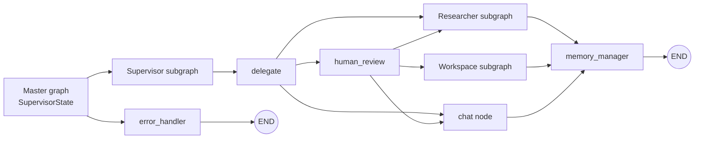
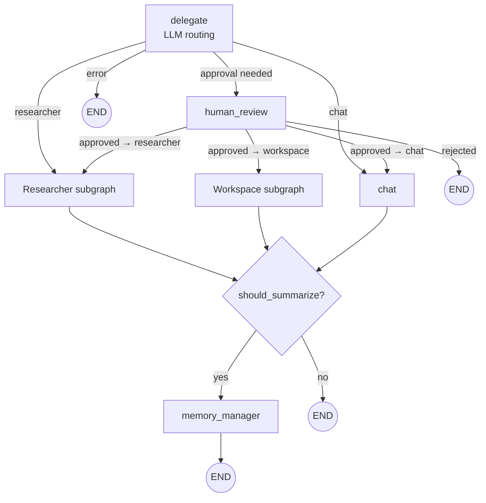
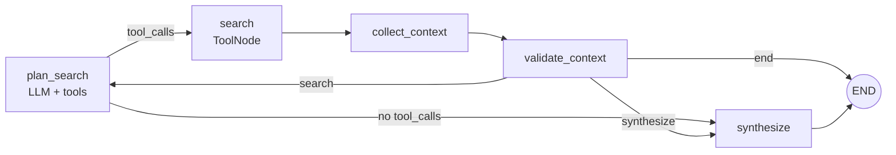
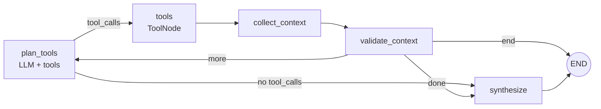

# Agent Orchestration

The heart of this project. This doc explains how the LangGraph engine is structured, how routing decisions are made, and where to extend.

All code for this module lives under `app/modules/agent_orchestration/` and follows the same clean-architecture split as other modules:

```text
agent_orchestration/
├─ domain/              # Pure logic — state TypedDicts, routing rules, policies, prompt enums
├─ application/         # Use cases + ports + DTOs (AgentRunResult, AgentEvent, …)
└─ infrastructure/      # LangGraph engine, prompt registry, tool registry, LLM registry, MCP bootstrap
```

## The orchestrator port

`IAgentOrchestrator` (in `application/ports/agent_orchestrator_port.py`) exposes four operations:

| Method | Purpose |
|---|---|
| `invoke(message, session_id, user_id)` | Run once, return final `AgentRunResult` |
| `stream(...)` | Async iterator of per-node `AgentEvent`s |
| `resume(thread_id, action, feedback)` | Continue a paused run (HITL) |
| `get_state(thread_id)` | Snapshot of the current state (next nodes, tasks, interrupted?) |

**`MainGraphOrchestrator`** is the only adapter. It is the single place that knows LangGraph exists — everything else receives DTOs.

## Graph hierarchy



## Master graph

`main_graph_builder.py` composes the whole system:

1. Pull LLM via `ILLMRegistry` (default provider/model from settings).
2. Optionally build a separate **memory summariser** LLM if `MEMORY_SUMMARIZER_PROVIDER/MODEL_NAME` are set.
3. Fetch all registered tools from `IToolRegistry`, then partition them into two buckets (see [Tool partitioning](#tool-partitioning)).
4. Build prompt provider (`FilePromptRegistry` over `prompt_registry.toml`).
5. Compile the supervisor subgraph and wrap it:
   - `supervisor` node → `error_handler` → `END`.
6. Compile with `PostgresSaver` as checkpointer.

The master graph intentionally only has two nodes — `supervisor` and `error_handler`. All real logic lives in subgraphs so that each can be tested and evolved independently.

## Supervisor subgraph



### Nodes

| Node | Kind | Responsibility |
|---|---|---|
| `delegate` | LLM call | Read the user message; decide which specialist should handle it (`researcher`, `workspace`, `chat`). Emits `next_agent` + `delegation_reasoning`. |
| `human_review` | Interrupt | Pauses the run when the planned agent is `workspace` (i.e. tools with side effects). Surfaces an `approval_request` payload. |
| `researcher` | Subgraph | Read-only information gathering via research tools. |
| `workspace` | Subgraph | Side-effecting tool execution (filesystem MCP, etc.). |
| `chat` | LLM call | Conversational reply when no tools are needed. |
| `memory_manager` | LLM call | Summarises old messages when conversation grows past a threshold. |

### Deterministic routers (pure functions)

Lives in `domain/routing_rules/`:

- `route_to_human_review` — after `delegate`: errors → END; `workspace` → `human_review`; anything else → go direct.
- `route_after_human_review` — after interrupt: if `human_feedback == "approved"` go to original `next_agent`, else END.
- `route_post_reply` (inline in `supervisor_graph`) — if message count exceeds `MEMORY_SUMMARIZATION_TRIGGER_MESSAGES`, go to `memory_manager`, else END.
- `route_researcher` — after context validation: `search` (replan), `synthesize`, or `end`.

These are pure `state → node_name` functions. They're unit-tested in isolation in `tests/unit/test_routing_rules.py`.

## Researcher subgraph

Used for **information retrieval** with read-only tools (`web_search`, `rag_search`, `get_local_time`, and any MCP tool explicitly assigned to researchers).



- `plan_search` has a **retry-on-format-error** loop that adds a natural-language nudge when LLM tool_use formatting is malformed.
- `collect_context` drains the most recent run of `ToolMessage`s into `retrieved_context`.
- `validate_context` is another small LLM call: decides whether more searching is needed.
- `synthesize` produces the final, conversational reply — explicitly instructed to be short and warm.

## Workspace subgraph

Near-identical topology to the researcher, but bound to **side-effecting** tools (filesystem MCP, etc.).



The split is intentional: workspace reaches this subgraph **only through the `human_review` interrupt**, so destructive or filesystem-modifying actions always pass through human approval first.

## State schemas

All states are TypedDicts with the LangGraph `add_messages` reducer:

- **`BaseAgentState`** — `messages`, `session_id`, `user_id`, `error`, `human_feedback`.
- **`SupervisorState`** — adds `next_agent`, `delegation_reasoning`.
- **`ResearcherState`** — adds `retrieved_context` (list of strings from the most recent tool pass).

Domain code uses TypedDicts directly; DTOs (`AgentRunResult`, `AgentEvent`, `AgentStateSnapshot`) are the *external* shape returned from the port.

## Prompts

Prompts are **assets**, not code. They live under `modules/agent_orchestration/infrastructure/prompts/` as Jinja templates with YAML frontmatter (intent, version, metadata). They are declared in `app/core/config/prompt_registry.toml`:

```toml
[intents]
supervisor_routing = "supervisor/supervisor_routing_v1.md.jinja"
researcher_agent   = "researcher/researcher_agent_v1.md.jinja"
workspace_agent    = "workspace/workspace_agent_v1.md.jinja"
chat_agent         = "chat/chat_agent_v1.md.jinja"
structured_output_system = "shared/structured_output_system_v1.md.jinja"
researcher_context_validation = "researcher/context_validation_v1.md.jinja"
workspace_context_validation  = "workspace/context_validation_v1.md.jinja"
```

`FilePromptRegistry` (in `infrastructure/registries/`) implements `IPromptProvider`. To add a prompt, drop a new `.md.jinja` file and add its intent to the TOML — no code change needed. Override the location via `PROMPT_ASSETS_DIR` / `PROMPT_REGISTRY_PATH` in `.env` for Docker volumes.

## Memory policy

Defined in `domain/memory_policy.py` + `domain/memory_budget.py`. Triggered from the supervisor graph:

- `MEMORY_SUMMARIZATION_TRIGGER_MESSAGES` (default 40) — if message count ≥ this, summarise.
- `MEMORY_SUMMARIZATION_KEEP_RECENT_MESSAGES` (default 12) — keep the last N verbatim.
- `MEMORY_SUMMARY_MAX_CHARS` (default 4 000) — cap summary size.
- All other historical messages are rolled into a single compact summary `AIMessage` tagged as internal; the router filters these from user-visible output (`is_internal_memory_summary_message`).

## Context / token budget

- `AGENT_MAX_CONTEXT_TOKENS` (default 12 000) — used with LangChain's `trim_messages` to cap prompt size per subgraph turn.
- `SUPERVISOR_ROUTING_MAX_TOKENS` (default 2 048) — tighter cap for the lightweight routing step.
- `MAX_TOOL_OUTPUT_CHARS` (default 10 000) — truncates any single tool call's result (both sync and async paths) before it re-enters the graph.

## Human-in-the-loop (HITL)

Triggered whenever `delegate` routes to `workspace`. The graph pauses on the `human_review` interrupt. The caller sees `interrupted: true` in the response, plus an `approval_request` payload describing the intended action.

Resuming uses `POST /api/v1/runs/{thread_id}/resume`:

```json
{
  "action": "approve",          // or "reject"
  "feedback": "optional string"
}
```

- `action=approve` → `human_feedback="approved"` → run proceeds to the originally chosen agent.
- Anything else → run ends without executing the tool.

`GraphNotInterruptedError` is raised if you try to resume a run that isn't paused.

## Tool partitioning

Every registered tool is bucketed into **researcher**, **workspace**, or both, before being bound to the subgraphs. Rules (in `infrastructure/langgraph_engine/tool_partition.py` + `domain/tool_bucket_policy.py`):

1. Built-ins `rag_search`, `web_search`, `get_local_time` → researcher by default.
2. Everything else (including all MCP tools) → workspace by default.
3. `tool_bucket_policy.TOOL_BUCKET_OVERRIDES` lets you pin a tool to specific buckets (or both).

If you add a new tool that should be usable by both subgraphs, add an override — do **not** mutate `BUILTIN_RESEARCH_TOOL_NAMES`.

Detailed guide: [`tools.md`](./tools.md).

## Checkpointing

- `PostgresSaver` from `langgraph-checkpoint-postgres` is the checkpointer.
- Thread key = `session_id`.
- On every super-step the state is persisted; `get_state` and `resume` read from it.
- Schema is auto-created on first use; see [`data-model.md`](./data-model.md#langgraph-checkpointer).

## Extending the engine

- **Add a node** to an existing subgraph — edit that subgraph's builder, add the node and the conditional edges. Keep the router pure (add it to `domain/routing_rules/`).
- **Add a subgraph** — build it, compile it, add it to the supervisor graph, and teach `delegate` that the new agent exists (prompt + enum in `next_agent` literal).
- **Add a tool** — see [`tools.md`](./tools.md).
- **Swap the LLM provider for just one node** — the orchestrator already supports a separate `researcher_llm` / `memory_llm`; pass a different model down through the builder signatures.
