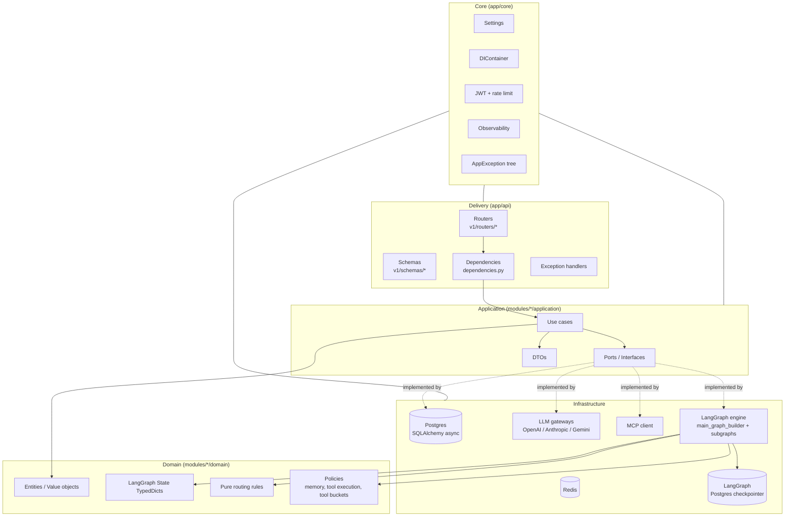
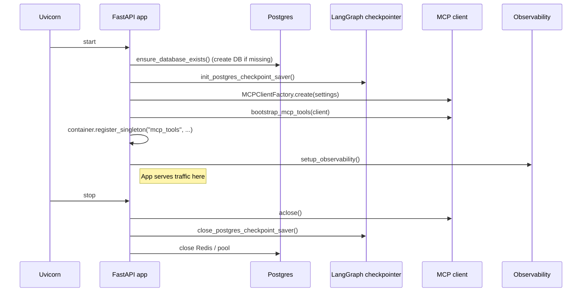

# Architecture

This project is a **vertical-module, clean-architecture** FastAPI application. The goal is that domain logic is insulated from frameworks (FastAPI, SQLAlchemy, LangGraph, LangChain, MCP SDK) and is independently testable.

## Core principles

1. **Dependency rule** — inner layers never import outer layers.
2. **Ports and adapters** — I/O is hidden behind interfaces (`.../application/ports/*`); concrete implementations live under `infrastructure/`.
3. **Vertical modules** — each business capability (`users`, `sessions`, `agent_orchestration`) owns its own `domain` / `application` / `infrastructure` tree.
4. **Pure domain** — `domain/` holds dataclasses, TypedDicts, enums, and pure-function routers. No frameworks, no I/O.
5. **Use cases orchestrate** — `application/use_cases/*.py` compose ports to fulfil a single business action.

## High-level layer diagram



## Top-level layout

```text
app/
├─ api/              # Delivery — FastAPI routers, Pydantic schemas, DI factories, exception handlers
├─ core/             # Cross-cutting — settings, DI container, security, observability, exceptions
├─ infrastructure/   # Shared adapters — database, cache, LLM gateways, MCP gateways
├─ modules/          # Vertical business modules
│  ├─ users/
│  ├─ sessions/
│  └─ agent_orchestration/
└─ shared/           # Cross-module primitives (base_model, base_repository port, uuid_utils)

workers/             # Celery app + background task entrypoints
alembic/             # Database migrations
hooks/               # Git hook scripts (pre-commit dependency sync)
scripts/             # Developer startup / dependency sync scripts
tests/               # Unit, integration, and e2e tests
docs/                # This directory
```

## Module anatomy

Every vertical module follows the same three-layer pattern:

```text
modules/<feature>/
├─ domain/           # Pure Python, no framework imports
├─ (application|use_cases|ports)/
│                    # Orchestration + interfaces
└─ infrastructure/   # Adapters that satisfy ports
```

- **`users`** — account registration, login, JWT issue/refresh. UoW-backed.
- **`sessions`** — conversation session lifecycle. UoW-backed.
- **`agent_orchestration`** — the LangGraph engine. Owns graph states, routing rules, prompt policies, tool policies, and the concrete compilation into a `CompiledStateGraph`. See [`agent-orchestration.md`](./agent-orchestration.md).

## The dependency rule in practice

- `api/` imports from `application/` (use cases + DTOs + ports), never from `infrastructure/`.
- `application/` imports from `domain/` and its own `ports/`, never from `infrastructure/`.
- `infrastructure/` imports from `application/ports/` and `domain/` — it implements ports.
- `domain/` imports only from `domain/` (and stdlib / pydantic).

LangGraph / LangChain types are **banned everywhere except** inside `modules/agent_orchestration/infrastructure/langgraph_engine/…`. `MainGraphOrchestrator` is the single adapter that speaks LangGraph; everyone else sees DTOs like `AgentRunResult`, `AgentEvent`, `AgentStateSnapshot`.

## Composition root

Adapters are wired to ports in two places:

1. **`app/api/dependencies.py`** — FastAPI `Depends()` factories. Builds `UnitOfWork`, `UserService`, `SessionService`, `ToolRegistry`, `LLMRegistry`, `MainGraphOrchestrator`, and the agent-orchestration use cases per request (with a cached orchestrator keyed on tool config).
2. **`app/core/config/di_container.py`** — a small singleton registry. Used from `lifespan` to stash long-lived objects (loaded MCP tools, MCP client, orchestrator) that must survive between requests.

The container is deliberately minimal — swap for `dependency-injector` if wiring complexity grows.

## Lifespan (startup / shutdown)

From `app/main.py`:



## Error model

All expected failures raise a subclass of `app.core.exceptions.AppException` (e.g. `AuthenticationError`, `RateLimitExceededError`, `AgentExecutionError`, `GraphCompilationError`, `GraphNotInterruptedError`, `MCPBootstrapError`). The global handler in `app/api/exception_handlers.py` maps them to consistent JSON responses with the correct HTTP status.

Unhandled exceptions hit `unhandled_exception_handler` and produce a generic 500, with full stack in server logs.

## Observability

- Every HTTP request gets an `x-request-id` header (generated if absent), stored in a `ContextVar` so loggers can tag records.
- Response headers include `x-request-id` and `x-process-time-ms`.
- OpenTelemetry instrumentation is wired up in `setup_observability()` (conditional on `OTEL_EXPORTER_ENDPOINT`).
- LangSmith tracing is enabled automatically when `LANGSMITH_API_KEY` is set.
- Structured logs use dotted keys (`api.request`, `graph.invoke completed`, `tool.run slow`, etc.) — easy to grep in Loki/ELK.

## What's *not* here on purpose

- No DI framework — the hand-rolled container is small and explicit.
- No CQRS — use cases return DTOs directly.
- No event bus — direct method calls between layers. Add one only if cross-module async becomes painful.
- No GraphQL — REST is sufficient for current consumers.
