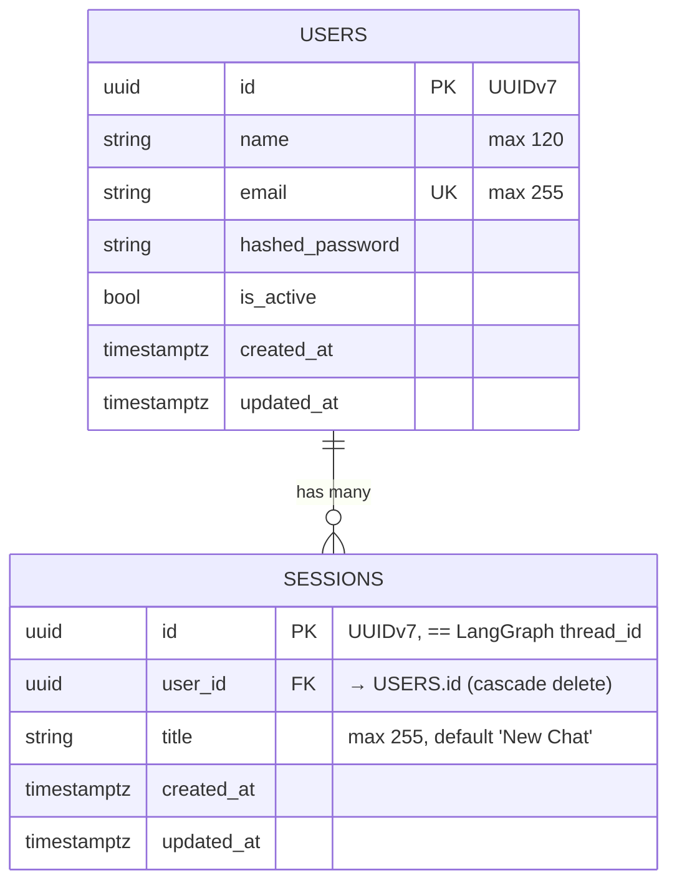

# Data Model

This project uses **PostgreSQL** through SQLAlchemy 2.x async, plus LangGraph's own Postgres checkpointer for conversation state.

## Entity-relationship diagram



## Tables

### `users` (`app/infrastructure/database/postgres/models/user_model.py`)

| Column | Type | Constraints |
|---|---|---|
| `id` | `UUID` | PK, default `uuid7()` |
| `name` | `VARCHAR(120)` | not null |
| `email` | `VARCHAR(255)` | unique, indexed, not null |
| `hashed_password` | `VARCHAR(255)` | not null, bcrypt via passlib |
| `is_active` | `BOOLEAN` | not null, default `true` |
| `created_at` | `TIMESTAMPTZ` | not null, default `now(UTC)` |
| `updated_at` | `TIMESTAMPTZ` | not null, auto-updated |

Relationship: `sessions = relationship("SessionORM", back_populates="user", cascade="all, delete-orphan")`.

### `sessions` (`app/infrastructure/database/postgres/models/session_model.py`)

| Column | Type | Constraints |
|---|---|---|
| `id` | `UUID` | PK, default `uuid7()` |
| `user_id` | `UUID` | FK → `users.id`, `ON DELETE CASCADE`, indexed |
| `title` | `VARCHAR(255)` | not null, default `"New Chat"` |
| `created_at` | `TIMESTAMPTZ` | not null |
| `updated_at` | `TIMESTAMPTZ` | not null, auto-updated |

**The session `id` doubles as the LangGraph `thread_id`.** This is the glue between the REST surface and the checkpointer — deleting a session does *not* delete the thread's checkpoint rows (they're harmless orphans; prune manually if desired).

### ID strategy

All primary keys are **UUIDv7** (see `app/shared/uuid_utils.py`). UUIDv7s are time-sortable, which keeps B-tree indexes compact and list ordering intuitive ("newest first" === `ORDER BY id DESC`).

## Migrations

`alembic/` manages schema changes.

- `alembic/env.py` wires a sync psycopg URL (via `settings.get_database_sync_url()`) so Alembic doesn't need async drivers.
- `alembic/versions/31121b69cc8e_initial_schema.py` is the initial migration (creates `users` + `sessions`).

Commands:

```bash
alembic upgrade head              # apply all pending migrations
alembic revision --autogenerate -m "add column foo"
alembic downgrade -1              # rollback one
```

## Unit of Work

Database access uses a `SqlAlchemyUnitOfWork` (in `app/infrastructure/database/postgres/unit_of_work.py`) that exposes repositories (`user_repository`, `session_repository`) and commits/rolls-back atomically. Use cases always interact through the UoW — they never construct repositories directly.

```python
async with uow:
    user = await uow.users.get_by_email(email)
    session = await uow.sessions.create(user_id=user.id, title="…")
    await uow.commit()
```

## Domain ↔ ORM mapping

Domain entities are pure dataclasses/Pydantic under `modules/<feature>/domain/*`. Repositories map ORM rows → domain objects so upper layers never see SQLAlchemy types.

- `UserORM` ↔ `User`  (`modules/users/domain/user.py`)
- `SessionORM` ↔ `Session`  (`modules/sessions/domain/session.py`)

## pgvector (optional)

When `PGVECTOR_ENABLED=true`, `app/infrastructure/database/postgres/vector_store.py` builds a LangChain `PGVector` retriever using:

- `EMBEDDING_MODEL`, `EMBEDDING_DIMENSIONS`
- `PGVECTOR_COLLECTION`
- `OPENAI_API_KEY` (the retriever uses OpenAI embeddings by default)

Requires the `pgvector` extension installed in the database (the `pgvector/pgvector:pg16` image used by `docker-compose.yml` already ships with it). The collection tables are auto-created by `langchain-postgres`.

## LangGraph checkpointer

LangGraph persists every super-step of every run using `PostgresSaver` from `langgraph-checkpoint-postgres`.

- Initialised during FastAPI `lifespan` (`init_postgres_checkpoint_saver()` in `app/modules/agent_orchestration/infrastructure/langgraph_engine/memory/postgres_saver.py`).
- Uses the **same Postgres database** as the app (sync URL).
- Schema is auto-provisioned on first use (`setup()` is called internally; `ensure_checkpointer_ready()` is idempotent).
- Rows are keyed by `thread_id` — which we set to `session_id`.

### What the checkpointer stores

For every step of a run:

- The full `messages` list (as serialised LangChain `BaseMessage` objects).
- The `SupervisorState` fields (`session_id`, `user_id`, `next_agent`, `delegation_reasoning`, `error`, `human_feedback`).
- The `ResearcherState.retrieved_context` when inside that subgraph.
- The "next" node(s) and any pending interrupts (the basis for HITL resume).

### Reading state

- `orchestrator.get_state(thread_id)` → `AgentStateSnapshot`
- `orchestrator.resume(thread_id, action, feedback?)` — resumes from the last checkpoint
- `orchestrator.invoke(message, session_id, user_id)` — appends a new user message and continues

### Cleanup

There is no automatic retention policy. Options:

1. Run a periodic job that deletes rows whose `thread_id` no longer matches a row in `sessions`.
2. Cap storage by pruning rows older than N days.
3. Leave them — the footprint per run is small and the tables are B-tree-indexed.

## Redis

Redis is used for:

- **Rate limiting** — slowapi keys.
- **Celery** — `CELERY_BROKER_URL` (broker) and `CELERY_RESULT_BACKEND` (results).
- **Ad-hoc caching** — surface in `app/infrastructure/cache/redis_manager.py`.

No app-level data is authoritative in Redis — it's safe to flush.
