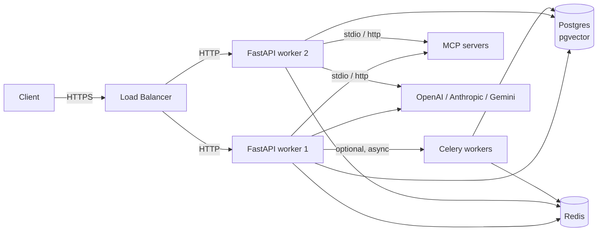

# Deployment

Running this project in environments other than `dev`.

## Topology



## Docker Compose (all-in-one dev)

`docker-compose.yml` ships three services plus Postgres and Redis:

| Service | Purpose |
|---|---|
| `postgres` | `pgvector/pgvector:pg16` with `pgvector` extension ready. |
| `redis` | `redis:7-alpine`. |
| `api` | FastAPI via Uvicorn with `--reload`. |
| `celery-worker` | Celery worker consuming the `CELERY_BROKER_URL` queue. |

Launch the full stack:

```bash
docker-compose up --build
```

Start only infra (recommended while developing the API locally):

```bash
docker-compose up -d postgres redis
```

## Production checklist

Before shipping to any non-dev environment:

1. **Secrets**
   - Generate a strong `JWT_SECRET_KEY` (e.g. `openssl rand -hex 64`).
   - Store provider API keys, DB password, and Redis password in your secret manager, not in the image.
2. **`ENVIRONMENT=production`, `DEBUG=false`**
   - Disables noisy MCP development warnings and hides sensitive tracebacks.
3. **CORS**
   - `app/main.py` currently uses `allow_origins=["*"]`. **Replace** with your front-end origins before production.
4. **Rate limiting**
   - `RATE_LIMIT_PER_MINUTE` is per-IP via `slowapi`. Raise or lower depending on traffic.
   - Consider an edge-level WAF / rate limiter upstream too.
5. **Database**
   - Apply migrations before rolling new versions: `alembic upgrade head`.
   - Set up automated backups (PITR or periodic `pg_dump`).
   - Size `DB_POOL_SIZE` / `DB_MAX_OVERFLOW` against your worker count.
6. **LangGraph checkpointer**
   - Runs in the same database. Plan a retention policy (see [`data-model.md`](./data-model.md#langgraph-checkpointer)).
7. **Redis**
   - Use TLS in production (`REDIS_SSL=true`, `rediss://`).
   - Separate DBs for rate limit / Celery broker / Celery result to keep cleanup simple (already defaulted).
8. **Observability**
   - Set `LANGSMITH_API_KEY` for prompt + run tracing.
   - Set `OTEL_EXPORTER_ENDPOINT` to ship traces to your collector (Grafana Tempo, Jaeger, Honeycomb, …).
   - Ship stdout JSON logs to your log aggregator (ELK, Loki, Datadog).
9. **MCP**
   - Stdio MCP servers spawn OS subprocesses inside the API container — make sure `npx` / `python` / etc. are installed in the image.
   - Pin MCP server package versions.
   - Prefer `streamable_http` MCP servers when they're available — no subprocess lifecycle to worry about.
10. **Graceful shutdown**
    - The `lifespan` handler closes Redis, the checkpointer, and MCP subprocesses on exit. Ensure your orchestrator sends SIGTERM (not SIGKILL) and gives the process time to drain.

## Running FastAPI at scale

Two ways to run the app:

### Uvicorn (simple)

```bash
uvicorn app.main:app --host 0.0.0.0 --port 8000 --workers 4
```

### Gunicorn + Uvicorn workers (recommended)

`app/core/config/gunicorn_configs.py` provides a production config. Typical invocation:

```bash
gunicorn app.main:app -c app/core/config/gunicorn_configs.py
```

Tune `WORKERS` (env var) against CPU count. For async-heavy workloads, **1 worker per core** is a reasonable start since most time is spent awaiting I/O.

### Notes on `--reload`

**Don't use `--reload` with stdio MCP servers in production.** Reload kills and respawns workers abruptly, which can strand subprocess trees. The `lifespan` logs a warning if you do this in development.

## Celery workers

Agent runs can be offloaded from the HTTP request cycle. Example task in `workers/agent_tasks.py::execute_agent_graph`:

```python
from workers.agent_tasks import execute_agent_graph
execute_agent_graph.delay(user_message, session_id, user_id)
```

Start workers:

```bash
celery -A workers.celery_app worker --loglevel=info --concurrency=2
```

When to use:

- **Long-running runs** (e.g. many tool calls) where you want a 202 + polling model.
- **Fan-out** — multiple agent runs triggered by one HTTP event.
- **Offline ingestion** — bulk scoring, batch summarisation.

When **not** to use:

- The chat endpoints already stream via SSE — most interactive cases don't need Celery.

## Scaling guidance

- **CPU-bound steps** are rare — token counting / trimming is minor. Most time is waiting on LLM / DB / MCP I/O.
- **Memory pressure** from message history is capped by `AGENT_MAX_CONTEXT_TOKENS` and the memory-summariser node.
- **LangGraph checkpointer** is the bottleneck for very high write concurrency. Shard by DB or use a read-replica pool if you approach it.
- **MCP stdio** doesn't scale horizontally per-process — each FastAPI worker maintains its own client. For shared MCP, prefer `streamable_http`.

## Zero-downtime deploys

- Alembic migrations should be **backwards-compatible** for one release (add column nullable, deploy, backfill, then drop in the next release).
- The orchestrator is cached per-process on a settings signature — restart all workers after changing any recompile-triggering setting (see [`configuration.md`](./configuration.md#recompile-on-change)).
- Use rolling restart so in-flight SSE streams finish on the old pods while new pods serve new traffic.

## Docker image tips

- Multi-stage build: build dependencies once, copy a slim runtime.
- Include Node.js **only** if you need stdio MCP servers like the filesystem MCP.
- Run as non-root (add `USER app` after install step).
- Read-only root filesystem + writable `/tmp` reduces blast radius.
- Include only runtime deps — omit `dev` extras (`pytest`, `ruff`, `mypy`) from production images.
