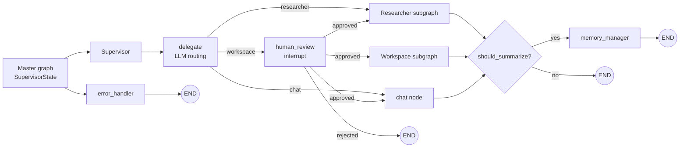
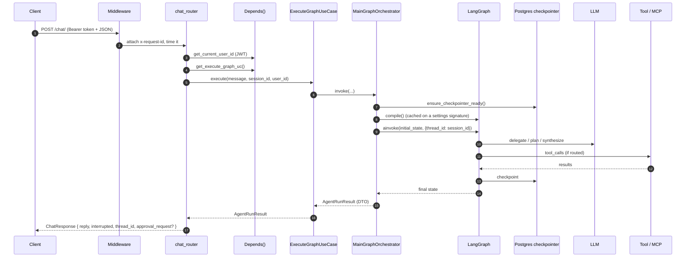

# Onboarding — New Developer Guide

Welcome. This is the **one document to read first** when joining the project. It is intentionally comprehensive: a 30‑minute read will give you the mental model, a working dev environment, a tour of the codebase, and the recipes for making your first change.

Everything here links out to deeper topic docs. Don't try to memorise the details — bookmark this page and follow the links when you need them.

> **TL;DR** — This is a FastAPI backend that exposes a LangGraph multi‑agent system (supervisor → researcher / workspace / chat) over authenticated REST endpoints, with Postgres persistence, optional Celery offload, and pluggable tools (built‑ins + MCP). The codebase is laid out as **Clean Architecture with vertical modules** so the agent logic, business rules, and HTTP delivery can evolve independently.

---

## Table of contents

1. [What this project is (and isn't)](#1-what-this-project-is-and-isnt)
2. [Prerequisites](#2-prerequisites)
3. [Day‑1 setup](#3-day1-setup)
4. [Verifying the install — your first chat](#4-verifying-the-install--your-first-chat)
5. [The 10‑minute architecture tour](#5-the-10minute-architecture-tour)
6. [The 30‑minute code tour — follow one request end to end](#6-the-30minute-code-tour--follow-one-request-end-to-end)
7. [Codebase map — "where do I go to change X?"](#7-codebase-map--where-do-i-go-to-change-x)
8. [Common recipes](#8-common-recipes)
9. [Daily developer workflow](#9-daily-developer-workflow)
10. [Debugging and common gotchas](#10-debugging-and-common-gotchas)
11. [Project conventions and rules of thumb](#11-project-conventions-and-rules-of-thumb)
12. [Glossary](#12-glossary)
13. [Where to go next](#13-where-to-go-next)

---

## 1. What this project is (and isn't)

### What it is

A production‑oriented backend for **chat‑style AI agents** built on:

- **FastAPI** as the HTTP delivery layer (`/api/v1/...`).
- **LangGraph** for stateful, multi‑agent orchestration with a supervisor pattern.
- **PostgreSQL** for application data (users, sessions) **and** for LangGraph's checkpointer (conversation state).
- **Redis** for caching, rate‑limiting, and Celery transport.
- **MCP (Model Context Protocol)** for plugging external tool servers in at startup.
- **Clean Architecture + vertical modules** so domain logic stays insulated from frameworks (FastAPI, SQLAlchemy, LangGraph, LangChain, the MCP SDK).

The agent itself supports:

- A **supervisor** that routes each user turn to the right specialist (chat / researcher / workspace).
- A **researcher** subgraph for read‑only information gathering (web search, RAG, time lookup).
- A **workspace** subgraph for side‑effecting tools (filesystem MCP, etc.) gated behind **human‑in‑the‑loop approval**.
- **Memory summarisation** when the conversation grows past a threshold.
- **Pluggable LLM providers** (OpenAI, Anthropic, Gemini) chosen via `.env`.

### What it isn't

- It is **not** an LLM library; we consume providers via LangChain adapters.
- It is **not** a generic agent framework; it's an opinionated backend that follows clean architecture so it can be safely extended.
- It is **not** a UI — there's no frontend in this repo. The only client‑facing surfaces are REST + SSE.
- It is **not** a vector database service; pgvector is used as an optional RAG retriever store, not as the source of truth for app data.

### Why clean architecture here

Agent code is notoriously hard to test because it tangles LLM calls, tool I/O, and routing logic. By isolating:

- **Domain** (pure Python: state schemas, routing rules, policies),
- **Application** (use cases + ports),
- **Infrastructure** (LangGraph wiring, LLM/MCP adapters, DB),

we get:

- Unit tests that run **without** an LLM, a database, or a network.
- The ability to swap an LLM provider, a tool, or even the entire orchestrator without touching routers or business modules.
- A clear blast radius for changes — touching `domain/` is high‑risk, touching `infrastructure/` is normal.

---

## 2. Prerequisites

Install these once:

| Tool | Why | Notes |
|---|---|---|
| **Python 3.11+** | Project requires it (`pyproject.toml`). | 3.13 also works. |
| **`uv`** | Dependency manager. | https://docs.astral.sh/uv/ |
| **Docker** | Runs Postgres + Redis locally. | Docker Desktop on Windows/macOS, native on Linux. |
| **Git** | Source control + pre‑commit hook. | — |
| **Node.js** | Only if you plan to use **stdio** MCP servers (e.g. filesystem MCP via `npx`). | Optional. |
| **At least one LLM key** | OpenAI, Anthropic, or Gemini. | Needed only when actually running the agent. |

Recommended editor: **VS Code** or **Cursor**. The repo ships a `.vscode/` folder with a dependency‑sync task that runs on folder open.

---

## 3. Day‑1 setup

A copy‑paste path from clone to running API. Detailed reference: [`getting-started.md`](./getting-started.md).

```bash
# 1) Clone
git clone <repo-url> workplace-help-agent
cd workplace-help-agent

# 2) Start infra (Postgres with pgvector + Redis)
docker-compose up -d postgres redis

# 3) Create + activate virtualenv
uv venv .venv
# Windows
.venv\Scripts\activate
# macOS / Linux
source .venv/bin/activate

# 4) Install dependencies
uv sync --extra dev

# 5) Configure environment
cp .env.example .env
#   Edit .env and set at minimum:
#   - JWT_SECRET_KEY      (any long random string)
#   - DEFAULT_LLM_PROVIDER  (openai | anthropic | gemini)
#   - DEFAULT_MODEL_NAME    (a valid model id for that provider)
#   - <provider>_API_KEY    (matching the provider above)

# 6) Apply DB migrations
alembic upgrade head

# 7) Enable the pre-commit hook (keeps requirements.txt synced)
git config --local core.hooksPath hooks

# 8) Run the API
# Windows (PowerShell)
./scripts/dev.ps1
# macOS / Linux
./scripts/dev.sh
```

The API is now live at **http://localhost:8000** with interactive OpenAPI at **/docs**.

> **`.env` wins over OS env.** Settings load order in `app/core/config/settings.py` is deliberate so stale shell variables can't silently override the repo `.env`. If a setting "looks ignored", double‑check `.env`.

Full setting reference: [`configuration.md`](./configuration.md).

---

## 4. Verifying the install — your first chat

After the API is running, this curl sequence proves the whole stack works:

```bash
# 1) Register
curl -X POST http://localhost:8000/api/v1/auth/register \
  -H "Content-Type: application/json" \
  -d '{"name":"Ada","email":"ada@example.com","password":"hunter22"}'

# 2) Login and capture the access_token from the response
curl -X POST http://localhost:8000/api/v1/auth/login \
  -H "Content-Type: application/json" \
  -d '{"email":"ada@example.com","password":"hunter22"}'

# 3) Create a session (replace $TOKEN)
curl -X POST http://localhost:8000/api/v1/sessions/ \
  -H "Authorization: Bearer $TOKEN" \
  -H "Content-Type: application/json" \
  -d '{"title":"first chat"}'

# 4) Chat (replace $SESSION_ID with the id you got back)
curl -X POST http://localhost:8000/api/v1/chat/ \
  -H "Authorization: Bearer $TOKEN" \
  -H "Content-Type: application/json" \
  -d '{"session_id":"'$SESSION_ID'","message":"Hi, what time is it in Tokyo?"}'
```

A successful reply through the `get_local_time` tool means:

- Postgres is reachable and migrated.
- The JWT round‑trip works.
- The orchestrator compiled, the supervisor routed correctly, and the LLM returned a reply.

Run the test suite to be sure:

```bash
pytest -v
```

(The e2e chat test is skipped by default unless `RUN_E2E=1` and real keys are present — see [`testing.md`](./testing.md).)

---

## 5. The 10‑minute architecture tour

Read this section, then skim [`architecture.md`](./architecture.md) for the diagrams.

### 5.1 Layer cake

```text
app/
├── api/             ← Delivery     (FastAPI routers, Pydantic schemas, Depends factories)
├── core/            ← Cross-cutting (Settings, DI container, JWT, observability, exceptions)
├── infrastructure/  ← Shared adapters (DB, cache, LLM gateways, MCP gateways)
├── modules/         ← Vertical business modules
│   ├── users/
│   ├── sessions/
│   └── agent_orchestration/   ← The LangGraph engine lives here
└── shared/          ← Cross-module primitives (base models, base repos, uuid)
workers/             ← Celery app + tasks (optional async path)
alembic/             ← DB migrations
hooks/               ← Git hooks (pre-commit dep sync)
scripts/             ← dev / sync scripts (PowerShell + sh)
tests/               ← unit / integration / e2e
docs/                ← this folder
```

Each vertical module repeats the same internal structure:

```text
modules/<feature>/
├── domain/                ← Pure Python: entities, TypedDicts, enums, policies, routing rules
├── (application|use_cases|ports)/
│                          ← Orchestration + interfaces (no framework calls)
└── infrastructure/        ← Adapters that implement the ports (only here may speak LangGraph / SQLAlchemy / MCP)
```

### 5.2 The dependency rule (memorise this)

Inner layers **never** import outer layers.

- `api/` → may import `application/` (use cases, DTOs, ports). Must **not** import `infrastructure/`.
- `application/` → may import `domain/` and its own `ports/`. Must **not** import `infrastructure/`.
- `infrastructure/` → implements ports, may import `domain/` and `application/ports/`.
- `domain/` → imports only from `domain/` (and stdlib / pydantic).

**LangGraph / LangChain types are banned everywhere except inside** `modules/agent_orchestration/infrastructure/langgraph_engine/…`. The single bridge between LangGraph and the rest of the app is `MainGraphOrchestrator`, which fulfils the `IAgentOrchestrator` port and only ever returns DTOs (`AgentRunResult`, `AgentEvent`, `AgentStateSnapshot`).

If you find yourself importing `langgraph` outside that folder, you're about to introduce a leak — stop and add a port instead.

### 5.3 The agent graph in one picture



Key ideas:

- The **master graph** is intentionally tiny (supervisor + error handler). All real logic lives in **subgraphs** for independent testing.
- The **workspace** subgraph (side‑effecting tools) is **always** behind the `human_review` interrupt. The researcher subgraph (read‑only) is not.
- Routing decisions between nodes are **pure functions** in `domain/routing_rules/` — they don't call LLMs, so they're trivially unit‑testable.

Deeper dive: [`agent-orchestration.md`](./agent-orchestration.md).

### 5.4 Persistence model

- App tables: `users`, `sessions` (managed by Alembic, see [`data-model.md`](./data-model.md)).
- LangGraph checkpointer: same Postgres DB, schema auto‑provisioned on first run.
- **`session.id` is reused as LangGraph's `thread_id`.** This is the glue between REST and the checkpointer — every chat call resumes the same thread.

### 5.5 Composition root

Adapters get wired to ports in two places:

1. **`app/api/dependencies.py`** — FastAPI `Depends()` factories. Per‑request construction of `UnitOfWork`, services, registries, and use cases. The orchestrator is cached on a settings signature so it doesn't rebuild on every call.
2. **`app/core/config/di_container.py`** — a tiny singleton registry used by `lifespan` to stash long‑lived objects (MCP tool list, MCP client, the cached orchestrator) that must outlive a single request.

There is **no DI framework**. The container is a `dict` with helper methods. If wiring complexity ever explodes, swap it for `dependency-injector` — but please don't add one preemptively.

---

## 6. The 30‑minute code tour — follow one request end to end

This is the single most useful exercise on day 1. Open the files as you read.

### What happens on `POST /api/v1/chat/`



### Files to open, in order

1. **`app/main.py`**
   - Middleware (`x-request-id`, timing), CORS, exception handlers.
   - `lifespan()` does startup: ensure DB, init checkpointer, build MCP client, bootstrap MCP tools, register observability.

2. **`app/api/v1/routers/chat_router.py`**
   - Validates `ChatRequest`, calls `ExecuteGraphUseCase.execute(...)`, shapes `ChatResponse`. Notice: it never imports LangGraph.

3. **`app/api/dependencies.py`**
   - `get_current_user_id` parses the bearer token.
   - `_build_tool_registry` registers built‑ins (web_search, rag_search, get_local_time) + pulls MCP tools from the container, blocking name collisions.
   - `_get_orchestrator` returns a cached `MainGraphOrchestrator`, rebuilding it only when a recompile‑triggering setting changed (`_orchestrator_tool_config_sig`).

4. **`app/modules/agent_orchestration/application/use_cases/execute_graph_uc.py`**
   - Calls `orchestrator.invoke(...)` and normalises infrastructure errors (rate limits → `RateLimitExceededError`, anything else → `AgentExecutionError`).

5. **`app/modules/agent_orchestration/infrastructure/langgraph_engine/main_graph_builder.py`**
   - The **single** place that knows LangGraph exists. Pulls the LLM via `ILLMRegistry`, partitions tools into researcher / workspace buckets, builds the supervisor subgraph, wraps it in the master graph, and compiles against `PostgresSaver`.

6. **`app/modules/agent_orchestration/infrastructure/langgraph_engine/subgraphs/supervisor/`**
   - `delegate` (LLM call) emits `next_agent`.
   - `route_to_human_review` (pure router) sends `workspace` through the interrupt.
   - `human_review` interrupts the run — caller sees `interrupted: true`.

7. **`tool_partition.py` + `domain/tool_bucket_policy.py`**
   - Decide which subgraph each tool belongs to.

8. **DTOs**: `application/dtos/agent_result.py` — `AgentRunResult`, `AgentEvent`, `AgentStateSnapshot`, `AgentMessage`, `ApprovalRequest`.

The end‑to‑end story: HTTP → router → DTO → use case → port → orchestrator adapter → LangGraph → tools/LLM → DTO back up. **Domain code never sees a request object, and the router never sees a LangGraph message.**

Reference doc: [`request-flow.md`](./request-flow.md).

---

## 7. Codebase map — "where do I go to change X?"

| You want to change... | Open this |
|---|---|
| Add or modify an HTTP endpoint | `app/api/v1/routers/*` + corresponding schema in `app/api/v1/schemas/*` |
| Add a new DB column / table | `alembic/versions/` (new revision) + ORM in `app/infrastructure/database/postgres/models/` + domain entity in `app/modules/<feature>/domain/` |
| Add a new business module (e.g. "documents") | Create `app/modules/documents/{domain,application,infrastructure}` mirroring `users/` or `sessions/` |
| Add a new built‑in tool | `app/modules/agent_orchestration/infrastructure/tools/<name>.py` + register in `app/api/dependencies.py::_build_tool_registry` |
| Add an MCP server | `.env` → `MCP_SERVERS` JSON array (no code change). See [`architecture/mcp_integration.md`](./architecture/mcp_integration.md) |
| Pin a tool to a different bucket (researcher vs workspace) | `app/modules/agent_orchestration/domain/tool_bucket_policy.py::TOOL_BUCKET_OVERRIDES` |
| Add a new agent prompt | New `.md.jinja` under `app/modules/agent_orchestration/infrastructure/prompts/<intent>/` + register the intent in `app/core/config/prompt_registry.toml` |
| Add a new node to an existing subgraph | Edit that subgraph's builder + add a **pure** router function in `app/modules/agent_orchestration/domain/routing_rules/` |
| Add a new subgraph (e.g. "planner") | Build & compile the subgraph, add it as a node in the supervisor graph, teach `delegate` it exists (prompt + literal in `next_agent`) |
| Change context / memory budgets | `.env` (`AGENT_MAX_CONTEXT_TOKENS`, `MEMORY_SUMMARIZATION_*`, `MAX_TOOL_OUTPUT_CHARS`) — runtime read on each request |
| Tweak the supervisor's routing decisions | Prompt: `prompts/supervisor/supervisor_routing_v1.md.jinja`. Deterministic post‑decision rules: `domain/routing_rules/supervisor_router.py` |
| Add an LLM provider | `app/infrastructure/llm_gateways/<provider>_service.py` + register in `LLMRegistry` |
| Adjust auth (token life, hashing, etc.) | `app/core/security/jwt_service.py` + `.env` (`JWT_*`, `ACCESS_TOKEN_*`) |
| Add a background task | `workers/agent_tasks.py` + a `.delay(...)` call site |
| Change CORS / middleware | `app/main.py` |
| Change error → HTTP mapping | `app/core/exceptions.py` (define) + `app/api/exception_handlers.py` (handle) |

If you don't know where something lives, run a quick search before guessing — the layering is consistent enough that the right answer is almost always in the obvious place.

---

## 8. Common recipes

### 8.1 Add a built‑in tool

```python
# app/modules/agent_orchestration/infrastructure/tools/weather_tool.py
from pydantic import BaseModel, Field
from app.modules.agent_orchestration.infrastructure.tools.base_tool import ProjectBaseTool

class _Args(BaseModel):
    query: str = Field(description="What to look up.")

class WeatherTool(ProjectBaseTool):
    name: str = "get_weather"
    description: str = "Get current weather for a place. Use for 'weather in X' questions."
    args_schema: type[BaseModel] = _Args

    def _execute(self, query: str, **_) -> str:
        return fetch_weather(query)
```

Then:

1. Register it in `app/api/dependencies.py::_build_tool_registry`.
2. Decide its bucket — if it's read‑only, either add the name to `BUILTIN_RESEARCH_TOOL_NAMES` in `tool_partition.py` **or** add an override in `tool_bucket_policy.TOOL_BUCKET_OVERRIDES`.
3. If it needs config (API key, retriever), pull it from `Settings` in `_build_tool_registry` and **add the relevant field to `_orchestrator_tool_config_sig`** so the orchestrator recompiles when it changes.
4. Unit‑test `_execute` directly (no LLM, no graph).

Full guide: [`tools.md`](./tools.md).

### 8.2 Add an MCP server (no code change)

```bash
# .env
MCP_SERVERS=[{"name":"filesystem","transport":"stdio","command":"npx","args":["-y","@modelcontextprotocol/server-filesystem","mcp_workspace"]}]
```

Restart the app. The tools are exposed as `filesystem__<original_tool_name>`. Name collisions with built‑ins are rejected at boot with `MCPBootstrapError`. Filesystem paths are auto‑sandboxed under `mcp_workspace/` via `FilesystemPathNormalizer`.

MCP tool discovery happens **once at startup**. Adding or removing servers requires an app restart.

Full guide: [`architecture/mcp_integration.md`](./architecture/mcp_integration.md).

### 8.3 Add a database column

```bash
# 1) Edit the ORM model (app/infrastructure/database/postgres/models/<table>_model.py)
# 2) Generate a revision
alembic revision --autogenerate -m "add foo column to users"
# 3) Inspect the generated file under alembic/versions/ — fix anything autogenerate missed
# 4) Apply
alembic upgrade head
```

Rules:

- Migrations should be **backwards‑compatible for one release** (add nullable, deploy, backfill, then drop in the next release).
- Update the corresponding domain entity in `modules/<feature>/domain/` and the repository mapping.

Reference: [`data-model.md`](./data-model.md).

### 8.4 Add a new HTTP endpoint

1. Add a Pydantic request/response schema in `app/api/v1/schemas/`.
2. Add the route in a router under `app/api/v1/routers/`.
3. Wire it to a use case via `Depends()` in `app/api/dependencies.py`.
4. **Do not** put business logic in the router — keep it in a use case.
5. Test the use case with a fake adapter, and the endpoint with FastAPI's `TestClient` (see `tests/integration/`).

### 8.5 Add or change a prompt

Prompts are **assets**, not code.

1. Drop a new `.md.jinja` file under `app/modules/agent_orchestration/infrastructure/prompts/<intent>/`.
2. Add the intent → relative path mapping in `app/core/config/prompt_registry.toml`.
3. No code change needed; `FilePromptRegistry` picks it up.

For Docker / production where you want to override prompts without rebuilding the image, set `PROMPT_ASSETS_DIR` and/or `PROMPT_REGISTRY_PATH`.

### 8.6 Add an exception type

1. Subclass `AppException` (or a sub‑class) in `app/core/exceptions.py` with the right `status_code` and `code`.
2. Raise it from wherever it makes sense.
3. The global handler in `app/api/exception_handlers.py` automatically returns the standard JSON shape — no router change required.

---

## 9. Daily developer workflow

### Run the app while you work

```bash
./scripts/dev.ps1   # Windows
./scripts/dev.sh    # macOS / Linux
```

Both scripts:

- Verify `uv` is on `PATH`.
- Run `uv sync --frozen --extra dev` (or unfrozen if no lock).
- Start `uvicorn app.main:app --reload`.

> Don't use `--reload` while heavily exercising stdio MCP servers — `uvicorn` can strand subprocess trees on some platforms. The lifespan logs a warning when it detects this combo.

### Pre‑commit hook

Enable once per clone:

```bash
git config --local core.hooksPath hooks
```

`hooks/pre-commit` regenerates `requirements.txt` from `pyproject.toml` and stages it. This keeps non‑uv users (CI, Dockerfile) in sync.

### Quality gate (run before every PR)

```bash
ruff check .
ruff format --check .
mypy app
pytest -v
```

CI runs the same set. `mypy` is **strict** but only scoped to `app/` (tests are loose by design — see `pyproject.toml`).

### Test layout

```text
tests/
├── unit/          ← pure, fast, no I/O (routing rules, policies, schemas, JWT, …)
├── integration/   ← FastAPI TestClient against a real Postgres
└── e2e/           ← full stack incl. real LLMs (RUN_E2E=1 to opt in)
```

See [`testing.md`](./testing.md) for fixtures, mocks at the port boundary, and useful pytest flags.

### Branch / PR etiquette

- Branch from `main`.
- Keep PRs **small** and focused — easier to review, easier to revert.
- Commit messages: describe **intent** ("why"), not just what.
- Update docs when API or workflow changes — including this onboarding doc, if behaviour you'd want a new dev to know about has changed.
- See [`../CONTRIBUTING.md`](../CONTRIBUTING.md) for the PR checklist.

---

## 10. Debugging and common gotchas

### Tracing a single request

Every request gets an `x-request-id` (generated if the client didn't send one). It's stored in a `ContextVar` and stamped on every log record via the `request_context` formatter. Response headers also include `x-process-time-ms`. Grep your logs by `request_id=<uuid>` to see the full timeline.

LangSmith (when `LANGSMITH_API_KEY` is set) and OpenTelemetry (when `OTEL_EXPORTER_ENDPOINT` is set) ship structured traces.

### "My setting change didn't take effect"

Two layers of caching:

1. `get_settings()` re‑reads `.env` on every call — no in‑process LRU. ✅ Most settings apply immediately.
2. The **compiled LangGraph** is cached per process, keyed on a settings signature ([`configuration.md` → Recompile‑on‑change](./configuration.md#recompile-on-change)). Changing any of those settings rebuilds on the next request. Changing **other** settings (LLM keys, agent limits, MCP servers) requires that those are in the signature **or** an app restart.
3. **MCP tool bootstrap** happens once at startup. Adding/removing MCP servers requires a full restart.

### "The agent paused and I don't know what to do"

It hit `human_review`. The response includes `interrupted: true` and an `approval_request` payload. Continue with:

```bash
POST /api/v1/runs/{thread_id}/resume
{ "action": "approved", "feedback": "go ahead" }   # or "rejected"
```

If you try to resume a run that isn't paused, you get `409 GraphNotInterruptedError`. Inspect run state with `GET /api/v1/runs/{thread_id}/state`.

### "Access denied — path outside allowed directories" (filesystem MCP)

The MCP filesystem server resolves relative paths against its OS working directory (usually the repo root), so `example.txt` lands at `<repo>/example.txt` — outside the sandbox. The repo's `FilesystemPathNormalizer` interceptor rewrites bare/relative paths to absolute paths under `mcp_workspace/` before the MCP call. If you still see the error, your MCP_SERVERS config probably points the sandbox elsewhere — check the last argument to `@modelcontextprotocol/server-filesystem`.

### "OpenAPI says my endpoint takes wrong types"

That's almost always a Pydantic schema in `app/api/v1/schemas/` that drifted from the domain entity. Don't synchronise the two automatically — they're separate by design. Update the schema explicitly.

### Windows + Postgres async

`app/main.py` switches asyncio to `WindowsSelectorEventLoopPolicy` on Windows because `psycopg` async (used by LangGraph's checkpointer) requires it. Don't remove that line.

### "I changed `.env` and tests still fail"

Tests load settings the same way as the app, so `.env` matters. The test fixtures in `tests/conftest.py` may also override certain values. When integration tests fail with DB errors, check that Docker is up and `alembic upgrade head` has been run against the right DB.

### "Why is my tool always going to `workspace`?"

That's the default for anything that isn't `rag_search`, `web_search`, or `get_local_time`. To put it in the researcher bucket instead, add an override in `domain/tool_bucket_policy.py`. **Don't** mutate `BUILTIN_RESEARCH_TOOL_NAMES` — it's reserved for the three built‑ins.

### Mypy errors that look weird

The project is **strict mypy** with the Pydantic plugin. Common surprises:

- TypedDicts (LangGraph states) need explicit `total=False` / `NotRequired` where applicable.
- Async generator return types are `AsyncIterator[T]`, not `AsyncGenerator[T, None]`.
- Don't use `Any` — there's almost always a narrower type. If you really need it, comment why.

---

## 11. Project conventions and rules of thumb

- **Dependency rule above all** — if a PR breaks it, that's the comment to leave.
- **Ports + adapters around I/O.** If a new piece of code does I/O, give it a port in `application/ports/` and an adapter in `infrastructure/`. Use cases compose ports, never adapters.
- **DTOs cross layers; domain models don't.** Routers and use cases speak in DTOs (`AgentRunResult`, `UserResponse`). Domain entities stay inside their module.
- **Prompts are assets, not code.** Edit `.md.jinja` files, not Python strings.
- **Routing decisions are pure.** Anything in `domain/routing_rules/` must take a state and return a node name. No LLM calls, no I/O. Unit‑testable in isolation.
- **`session_id == thread_id`.** One session, one LangGraph thread. Don't introduce another mapping unless you really need to.
- **UUIDv7 everywhere.** PKs are time‑sortable; "newest first" is `ORDER BY id DESC`. Use `app/shared/uuid_utils.py`.
- **No DI framework.** The hand‑rolled `DIContainer` is intentional. If wiring gets painful, propose a switch — don't sneak one in.
- **No event bus, no CQRS, no GraphQL.** Keep direct method calls and REST + SSE until there's a concrete reason to change.
- **No comments narrating what code does.** Comments explain non‑obvious **why**, trade‑offs, and constraints. The code is the "what".

---

## 12. Glossary

| Term | Meaning here |
|---|---|
| **Port** | An interface in `application/ports/*` defining what a use case needs from the outside world. |
| **Adapter** | A concrete implementation of a port, living under `infrastructure/`. |
| **Use case** | An application‑layer function that orchestrates ports to fulfil one business action. Returns a DTO. |
| **DTO** | A transport‑safe data carrier (dataclass / Pydantic / TypedDict) that crosses layer boundaries. |
| **Session** | A row in `sessions`. Owned by a user. Its UUID **is** the LangGraph `thread_id`. |
| **Thread** | LangGraph's term for one checkpointed conversation timeline. We reuse `session_id`. |
| **Master graph** | The top‑level LangGraph (supervisor + error handler). |
| **Subgraph** | A self‑contained compiled graph (researcher, workspace, supervisor) embedded as a node in the master graph. |
| **Bucket** | The agent that a tool belongs to: `RESEARCHER` (read‑only) or `WORKSPACE` (side‑effecting). |
| **HITL** | Human‑In‑The‑Loop. A run pause via the `human_review` interrupt that requires `/runs/{thread_id}/resume`. |
| **MCP** | Model Context Protocol — an external standard for tool servers. We are a client; tools are discovered at startup. |
| **Checkpointer** | LangGraph's persistence layer. We use `PostgresSaver`, same DB as the app. |

---

## 13. Where to go next

Read in this order — each builds on the previous:

1. [`getting-started.md`](./getting-started.md) — install + first chat (skim if you already did §3).
2. [`architecture.md`](./architecture.md) — full diagrams of the layering and dependency rule.
3. [`request-flow.md`](./request-flow.md) — end‑to‑end flow for `POST /chat/`, `/chat/stream`, and HITL.
4. [`agent-orchestration.md`](./agent-orchestration.md) — supervisor / researcher / workspace internals.
5. [`tools.md`](./tools.md) — adding built‑in tools, the bucketing policy, MCP basics.
6. [`configuration.md`](./configuration.md) — every environment variable.
7. [`data-model.md`](./data-model.md) — DB schema, migrations, UoW, LangGraph checkpointer.
8. [`api-reference.md`](./api-reference.md) — full endpoint reference + SSE protocol + error shape.
9. [`testing.md`](./testing.md) — test layout, fixtures, conventions, coverage targets.
10. [`deployment.md`](./deployment.md) — production checklist, Docker, Celery, scaling.
11. [`architecture/mcp_integration.md`](./architecture/mcp_integration.md) — deep‑dive on MCP wiring and the filesystem sandbox.

Repo‑level references:

- [`../README.md`](../README.md) — outward‑facing project summary.
- [`../CONTRIBUTING.md`](../CONTRIBUTING.md) — PR checklist and quality bar.
- [`../SECURITY.md`](../SECURITY.md) — how to report a vulnerability responsibly.

When in doubt: read the source. The codebase is small enough that a quick `Grep`/`SemanticSearch` will usually answer the question faster than a doc lookup.

Welcome aboard.
