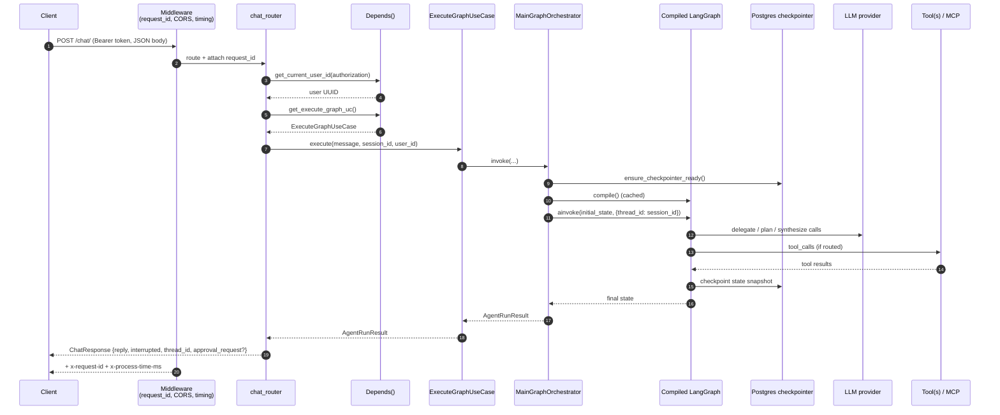
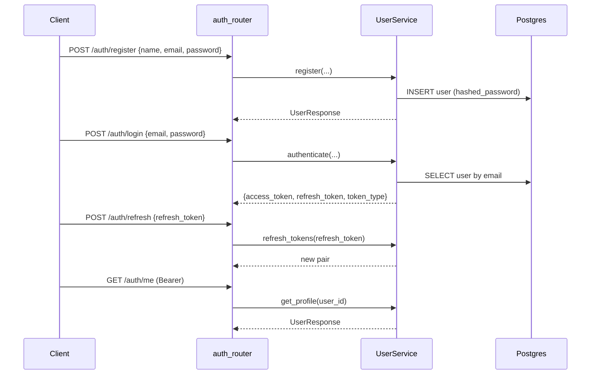

# Request Flow

How a single user turn travels through the stack, from HTTP to LLM and back.

## End-to-end: `POST /api/v1/chat/`

## Layer-by-layer

1. **Middleware** (`app/main.py`)
   - Generates or passes through `x-request-id`.
   - Records wall time.
   - Adds permissive CORS (tighten for production — see [`deployment.md`](./deployment.md)).

2. **Router** (`app/api/v1/routers/chat_router.py`)
   - Pure delivery adapter. Validates the `ChatRequest` schema, calls the use-case, and shapes the `ChatResponse`.
   - **Never** imports LangGraph / LangChain types.

3. **Dependencies** (`app/api/dependencies.py`)
   - `get_current_user_id` — parses `Authorization: Bearer <token>` and calls `verify_access_token`.
   - `get_execute_graph_uc` — returns `ExecuteGraphUseCase(orchestrator)`.
   - Orchestrator is built **once** and cached in the `DIContainer`, keyed on a tuple of settings that affect graph compilation (API keys, context limits, MCP config). If any changes, the graph is rebuilt.

4. **Use case** (`ExecuteGraphUseCase`)
   - Calls `orchestrator.invoke(...)`.
   - Catches infrastructure errors and normalises them:
     - Quota / rate-limit strings → `RateLimitExceededError` (429).
     - Other exceptions → `AgentExecutionError` (500, with redacted detail).

5. **Orchestrator** (`MainGraphOrchestrator`)
   - `_compile()` — lazy: builds the master `StateGraph` once.
   - Builds LLM instance via `ILLMRegistry`.
   - Partitions tools into **researcher** vs **workspace** buckets via `partition_tools_for_agents`.
   - Constructs the supervisor subgraph and wraps it in the master graph (with a terminal error handler).
   - Compiles against the Postgres checkpointer so every turn is persisted.

6. **LangGraph run** — see [`agent-orchestration.md`](./agent-orchestration.md) for the internal routing.

7. **Response**
   - `to_run_result(...)` maps the raw graph state to a DTO (`AgentRunResult`):
     - `last_ai_reply` — final user-facing message.
     - `interrupted` — true if the run paused at `human_review`.
     - `approval_request` — serialised payload describing what needs approval.
     - `thread_id` — equal to `session_id`.

## Variants

### Streaming: `POST /api/v1/chat/stream`

Identical stack up to the use case, but `StreamGraphEventsUseCase` yields an async iterator of `AgentEvent`s. The router wraps them as SSE:

- `stream_detail=content` (default) — only the latest AI message text per event.
- `stream_detail=full` — full per-node DTO with message history.
- Stream always terminates with `data: [DONE]`.

See [`api-reference.md`](./api-reference.md#streaming) for the wire format.

### Resume (HITL): `POST /api/v1/runs/{thread_id}/resume`

Same orchestrator, different entry point:

- `ResumeGraphUseCase.execute(...)` → `orchestrator.resume(...)`.
- `resume()` verifies the run is **paused** (`snapshot_is_paused`) then sends a LangGraph `Command(resume={action, feedback?})`.
- Raises `GraphNotInterruptedError` if nothing is waiting.

### State inspection: `GET /api/v1/runs/{thread_id}/state`

Wraps `orchestrator.get_state(...)`, returning a `RunStateSnapshot` DTO. Read-only — does not advance the graph.

## Authentication path

All subsequent authenticated calls pass the access token; `get_current_user_id` decodes it and returns a `UUID`.

## Session vs thread

- **Session** — a row in `sessions` table. Owned by a user. Has a title, timestamps.
- **Thread** — LangGraph's term for a checkpoint timeline. **We reuse `session_id` as `thread_id`** — one session == one thread. This gives "resume where you left off" for free across HTTP calls.

Deleting a session removes the DB row; LangGraph checkpoint rows for that thread remain in the checkpointer schema (they're harmless and cleaned manually if needed).
