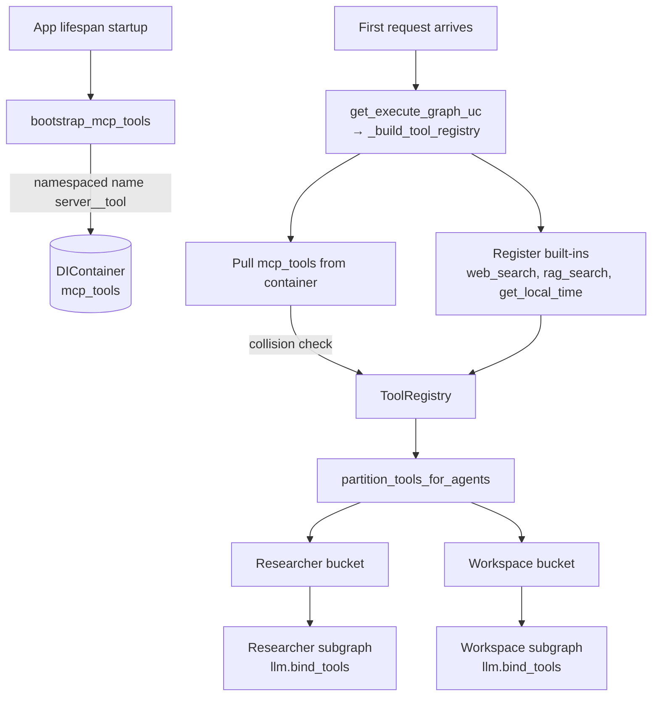

# Tools

How tools are defined, registered, bucketed, and exposed to the agent graph.

## Contract

Every tool is a LangChain `BaseTool`. Project-owned tools inherit from `ProjectBaseTool` (in `app/modules/agent_orchestration/infrastructure/tools/base_tool.py`) which adds:

- Structured logging with `request_id` correlation.
- Slow-tool warnings (`SLOW_TOOL_MS = 2000`).
- Consistent error handling.
- A single `_execute(**kwargs)` abstract method subclasses override.

## Built-in tools

| Name | Class | Description | Enabled when |
|---|---|---|---|
| `web_search` | `WebSearchTool` | Tavily-powered web search | `TAVILY_API_KEY` is set |
| `rag_search` | `RAGSearchTool` | Semantic search over the pgvector knowledge base | Always registered; returns a polite "not configured" message if no retriever |
| `get_local_time` | `GetLocalTimeTool` | Geocode a place + map to IANA timezone → local time. No web search. | Always |

All three live under `app/modules/agent_orchestration/infrastructure/tools/`.

## Registration flow



Key code paths:

- `app/api/dependencies.py::_build_tool_registry` — composes the registry per request cache.
- `app/modules/agent_orchestration/infrastructure/bootstrap/mcp_bootstrap.py` — MCP tool discovery.
- `app/modules/agent_orchestration/infrastructure/langgraph_engine/tool_partition.py` — bucket assignment.

## Bucketing

Tools are sorted into two execution slots before being bound to subgraphs:

| Bucket | Subgraph | Typical content |
|---|---|---|
| `RESEARCHER` | Researcher | Read-only info gathering (`web_search`, `rag_search`, `get_local_time`) |
| `WORKSPACE` | Workspace | Side-effecting tools (most MCP tools, filesystem writers, etc.) |

**Default rule** (`partition_tools_for_agents`):

- Built-ins `rag_search`, `web_search`, `get_local_time` → researcher only.
- Everything else → workspace only.

**Override table** (`app/modules/agent_orchestration/domain/tool_bucket_policy.py`):

```python
TOOL_BUCKET_OVERRIDES: dict[str, frozenset[AgentToolBucket]] = {
    # "get_local_time": frozenset({AgentToolBucket.RESEARCHER, AgentToolBucket.WORKSPACE}),
}
```

Put a tool name here to share it across buckets or re-pin it. **Never** mutate `BUILTIN_RESEARCH_TOOL_NAMES` — overrides exist for this exact purpose.

### Why split at all?

Because the workspace subgraph is behind a **human-approval interrupt**. Anything with side effects must land in `WORKSPACE` so a human sees the intended action before it runs. Read-only research can go direct.

## Output caps

Any single tool call's output is truncated (sync and async paths) before re-entering the graph:

- `MAX_TOOL_OUTPUT_CHARS` (default 10 000). Set `0` to disable.
- Implementation: `infrastructure/langgraph_engine/tool_output_cap.py` (returns wrap/awrap factories passed to LangGraph `ToolNode`).

## Error handling

Tool exceptions are converted into `ToolMessage` error payloads via LangGraph's `handle_tool_errors` hook (`researcher_tool_execution_error` in `shared_nodes/tool_error_handler.py`). The LLM sees a clean error string and can retry or apologise to the user — it does not see Python tracebacks.

## Adding a built-in tool

1. Create a subclass of `ProjectBaseTool`:

    ```python
    from pydantic import BaseModel, Field
    from app.modules.agent_orchestration.infrastructure.tools.base_tool import ProjectBaseTool

    class _Args(BaseModel):
        query: str = Field(description="What to look up.")

    class WeatherTool(ProjectBaseTool):
        name: str = "get_weather"
        description: str = "Get current weather for a place. Use for 'weather in X' questions."
        args_schema: type[BaseModel] = _Args

        def _execute(self, query: str, **_) -> str:
            return fetch_weather(query)
    ```

2. Register it in `_build_tool_registry` in `app/api/dependencies.py`:

    ```python
    registry.register(WeatherTool())
    ```

3. If it should go to researcher (read-only), either:
   - Add its name to `BUILTIN_RESEARCH_TOOL_NAMES` in `tool_partition.py` (for new first-class built-ins), **or**
   - Add an override entry in `tool_bucket_policy.TOOL_BUCKET_OVERRIDES`.

4. If your tool needs configuration (API keys, retrievers), load them from `Settings` in `_build_tool_registry` and add them to `_orchestrator_tool_config_sig` so the orchestrator recompiles when they change.

5. Add a unit test under `tests/unit/` that exercises `_execute` directly and verifies the bucket assignment.

## MCP

MCP servers are external tool providers (over stdio / Streamable HTTP / SSE). This project loads them **as a client** — LangChain tools are discovered once at startup and injected into `ToolRegistry`.

Full guide: [`architecture/mcp_integration.md`](./architecture/mcp_integration.md).

### Quick config

```bash
# Filesystem MCP sandboxed to ./mcp_workspace
MCP_SERVERS=[{"name":"filesystem","transport":"stdio","command":"npx","args":["-y","@modelcontextprotocol/server-filesystem","mcp_workspace"]}]
```

- Tools are exposed as `server_name__original_tool_name`.
- Descriptions are prefixed with `[server_name]`.
- Name collisions between MCP tools and built-ins are rejected at bootstrap (`MCPBootstrapError`).
- Filesystem MCP paths are normalised against the sandbox root to prevent escape-via-relative-path (`FilesystemPathNormalizer`).

### Supported transports

| Transport | When to use |
|---|---|
| `stdio` | Local subprocess (recommended for `@modelcontextprotocol/server-filesystem`) |
| `streamable_http` | Modern remote MCP servers |
| `sse` | Legacy; deprecated upstream, kept for compatibility |

### Lifecycle

- Discovered **once** at app startup.
- Not refreshed via `notifications/tools/list_changed` — restart the app to pick up new tools.
- Any tool error is converted to a tool error message for the LLM via `handle_tool_errors`.

## Tool registry port

Consumers of tools see only `IToolRegistry`:

```python
class IToolRegistry(Protocol):
    def register(self, tool: BaseTool) -> None: ...
    def get_tools(self, tool_names: list[str]) -> list[BaseTool]: ...
    def list_available(self) -> list[str]: ...
```

Concrete: `ToolRegistry` (`infrastructure/registries/tool_registry.py`). Swap it when you need, e.g., a dynamic / tenant-scoped registry.
